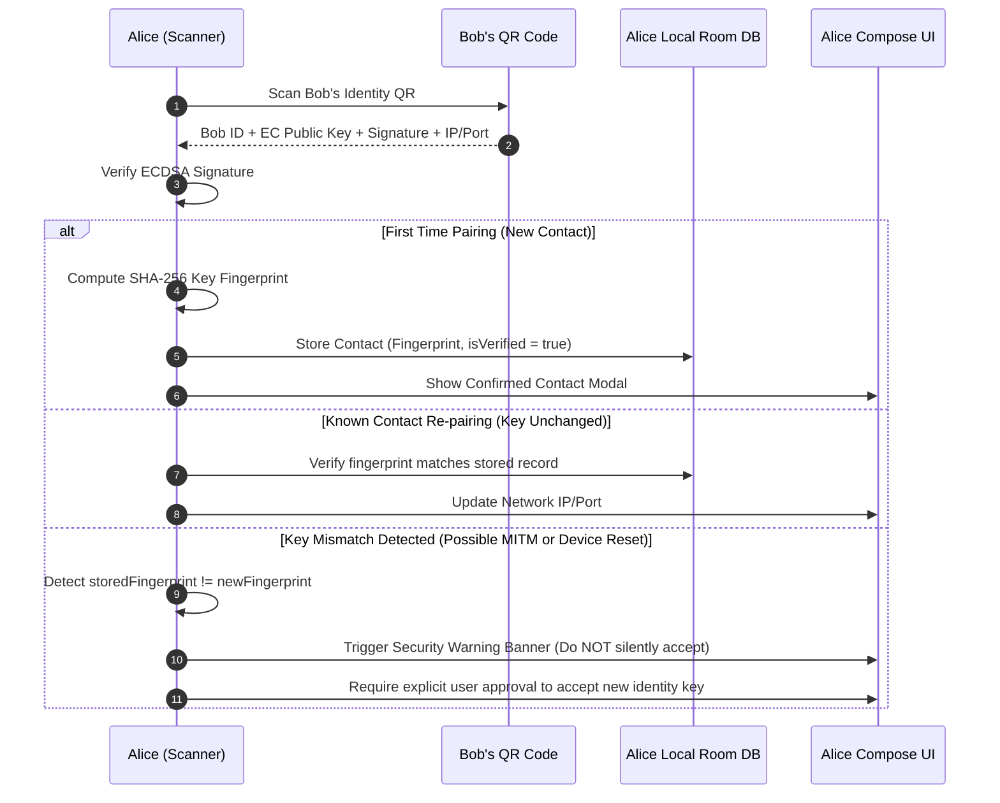
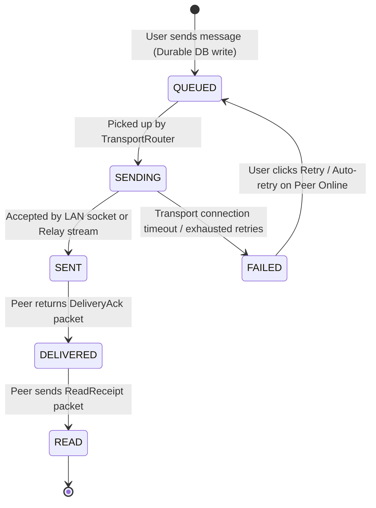

# System Design Document (DESIGN.md)
# Rebuilt Modern Peer-to-Peer Secure Chat Platform

**System Architecture & Engineering Specification**  
**Document Version:** 2.0.0 (Rebuild)  
**Target Platform:** Android (API 26–35, Target 35)  
**Core Technologies:** Kotlin 2.1+, Jetpack Compose (Material3), AndroidX Room (SQLite WAL), KotlinX Coroutines & Flow, Hilt DI, Android Keystore, ECDH / AES-256-GCM E2EE  

---

## 1. Architectural Overview & Topology

The application follows Clean Architecture with strict unidirectional data flow (UDF). Infrastructure never leaks into the presentation or domain layers.

```mermaid
graph TB
    subgraph UI_Layer ["Presentation Layer (Jetpack Compose)"]
        Activities[MainActivity (Nav Host Only)]
        Nav[AppNavigation / Navigation Compose]
        Screens[OnboardingScreen | PairingScreen | ChatListScreen | ChatScreen | ContactsScreen | SettingsScreen]
        VMs[OnboardingViewModel | PairingViewModel | ChatListViewModel | ChatViewModel | ContactsViewModel]
    end

    subgraph Domain_Layer ["Domain Layer (Pure Kotlin / Business Logic)"]
        UseCases[Use Cases: CreateIdentity, PairWithContact, SendMessage, ReceiveMessage, MarkRead, etc.]
        DomainModels[Models: Identity, Contact, Conversation, Message, Attachment, PeerPresence]
        RepoInterfaces[Interfaces: IdentityRepository, ContactRepository, ConversationRepository, MessageRepository]
        CryptoInterfaces[Interfaces: CryptoSession, KeyManager]
        TransportInterfaces[Interfaces: Transport, TransportRouter]
    end

    subgraph Data_Layer ["Data & Persistence Layer"]
        RepoImpls[Repositories: IdentityRepositoryImpl, MessageRepositoryImpl, etc.]
        RoomDB[(ChatDatabase v1: Identity, Contact, Conversation, Message, MessageDelivery, Session)]
        DataStore[DataStore Preferences]
        FileIO[MediaFileManager]
    end

    subgraph Crypto_Layer ["Cryptographic Subsystem"]
        KeyMgr[KeyManagerImpl (Android Keystore secp256r1)]
        CryptoSessionImpl[CryptoSessionImpl (ECDH Agreement + AES-256-GCM)]
    end

    subgraph Transport_Layer ["Multi-Transport Routing Network"]
        Router[TransportRouter]
        LAN[LanTransport (TCP :47832 Server/Client)]
        Relay[RelayTransport (HMAC Topic Hashing + HTTP/SSE Stream)]
    end

    UI_Layer --> VMs
    VMs --> Domain_Layer
    Domain_Layer --> RepoInterfaces
    Domain_Layer --> CryptoInterfaces
    Domain_Layer --> TransportInterfaces
    RepoInterfaces -.-> RepoImpls
    RepoImpls --> RoomDB
    RepoImpls --> DataStore
    RepoImpls --> FileIO
    RepoImpls --> Router
    CryptoInterfaces -.-> CryptoSessionImpl
    CryptoSessionImpl --> KeyMgr
    Router --> LAN
    Router --> Relay
```

---

## 2. Cryptographic Security Model

### 2.1 Invariants
- **Hard Failure Semantics:** Encryption and decryption failures are fatal domain events (`Result.Failure`). Under no circumstances is plaintext sent or returned when encryption/decryption encounters an error.
- **No Deterministic Fallbacks:** Keys are NEVER derived from user IDs, contact IDs, or deterministic strings.
- **No Multi-Key Guessing:** Only the established session key derived via authenticated ECDH is used.
- **Hardware Isolation:** Private keys are generated in and isolated by the Android Keystore (`secp256r1`).

### 2.2 Cipher Suite & Parameters
- **Asymmetric Agreement:** NIST P-256 (`secp256r1`) Elliptic Curve Diffie-Hellman (ECDH).
- **Symmetric Encryption:** `AES/GCM/NoPadding` (256-bit key).
- **IV/Nonce:** 12-byte (96-bit) cryptographically strong random bytes generated per encryption via `SecureRandom`.
- **Authentication Tag:** 128-bit GCM authentication tag. Tampered bytes trigger immediate tag rejection.
- **KDF:** SHA-256 over raw ECDH shared secret.
- **Signatures:** `SHA256withECDSA` for profile and identity verification.

---

## 3. Trust-On-First-Use (TOFU) Identity & Pairing Model



---

## 4. Message Lifecycle & State Machine

Every message follows an offline-first durable persistence workflow before network transmission:



---

## 5. Transport Layer Architecture

1. **LanTransport**: Direct TCP ServerSocket (Port 47832) for sub-50ms transmission when peers share a local subnet.
2. **RelayTransport**: SSE-based relay stream for WAN/cellular connectivity. Hides routing topics via HMAC-SHA256 topic hashing (`p2p_chat_<HMAC>`) to prevent direct enumeration of user IDs on public relays.
3. **TransportRouter**: Intelligently routes through LAN if the peer is confirmed on the same subnet, falling back to Relay otherwise. Does not blindly dual-dispatch redundant packets.

---

## 6. Database Schema (Room v1)

```
Identity Entity:
- id (PK), displayName, avatarUri, publicKeyBase64, fingerprint, createdAt, updatedAt

Contact Entity:
- id (PK), displayName, nickname, avatarUri, publicKeyBase64, fingerprint, age, bio, isBlocked, isVerified, lastKnownIp, lastKnownPort, lastSeenAt, pairedAt, updatedAt

Conversation Entity:
- id (PK), contactId (FK unique), lastMessageSnippet, lastMessageAt, unreadCount, createdAt

Message Entity:
- id (PK), conversationId (FK), senderId, text, status, isOutgoing, timestamp, createdAt

MessageDelivery Entity:
- messageId (PK FK), status, sentAt, deliveredAt, readAt, retryCount, failureReason
```

---

## 7. Limitations & Privacy Disclosures

- **Relay Metadata:** When routing across WAN via a relay, the relay server can observe packet timing, packet sizes, and hashed topic destinations. Message contents and private keys remain end-to-end encrypted.
- **LAN Discovery:** LAN transport requires both devices to be reachable on the local IP subnet without strict client isolation.
