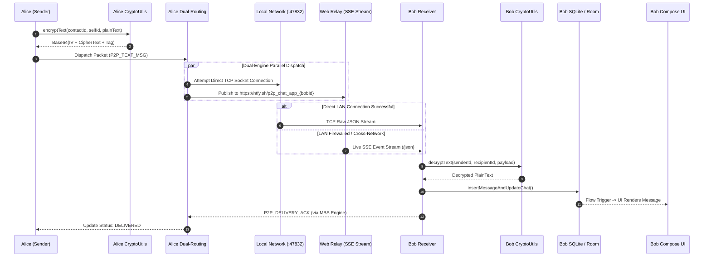
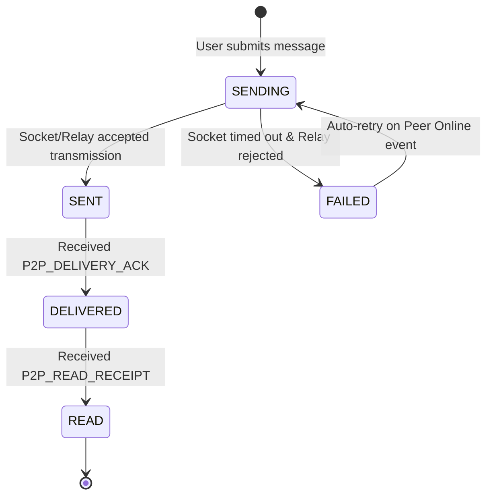
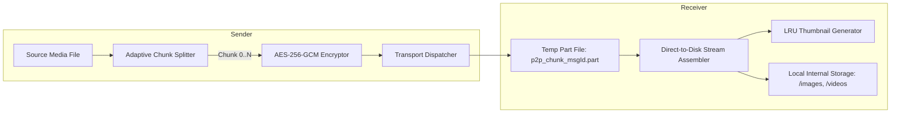
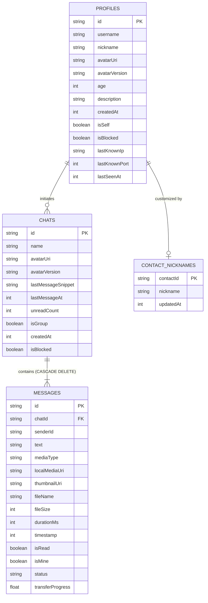
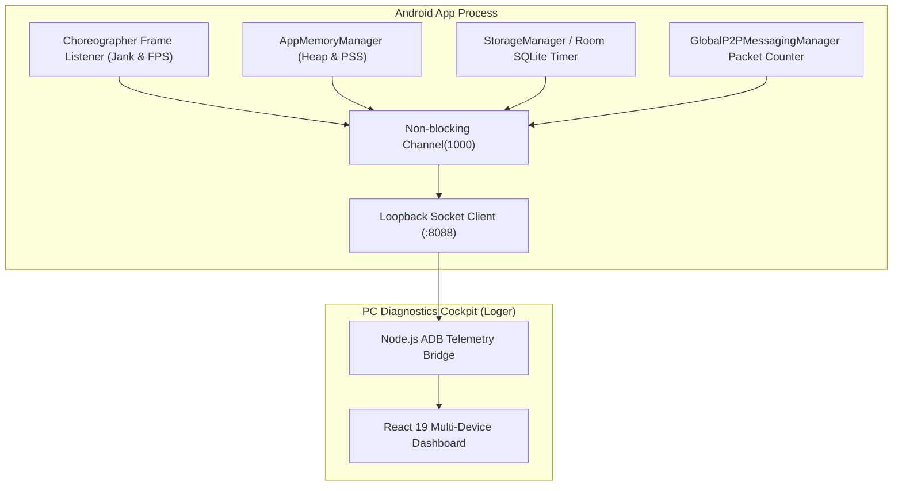

# System Design Document (DESIGN.md)
# High-Performance Decentralized P2P Secure Chat Platform

**System Architecture & Engineering Specification**  
**Document Version:** 2.0.0  
**Standard:** Google Senior Staff Software Engineering Grade  
**Target Platform:** Android (API 26–35, Target 35)  
**Language/Frameworks:** Kotlin 2.0+, Jetpack Compose (Material3), AndroidX Room (SQLite WAL), KotlinX Coroutines & Flow  

---

## 1. Architectural Overview & System Topology

### 1.1 Architectural Topology
The **Chat App** is built on an **Offline-First, Zero-Trust Peer-to-Peer Architecture**. The client acts simultaneously as an autonomous client node and a local micro-server.

```mermaid
graph TB
    subgraph UI_Layer ["Presentation & UI Layer (Jetpack Compose)"]
        Activities[MainActivity]
        Screens[ChatList | ChatRoom | Contacts | AddContact | Profile | MediaStorage | Onboarding]
        Components[AudioRecordingModal | MediaAttachmentSelector | ScannedProfileModal | SkeuComponents]
        Themes[ChatTheme / AppColors / SkeuColors]
    end

    subgraph State_Layer ["State & ViewModel Layer"]
        VM[ChatViewModel]
        StateFlows["StateFlow / SharedFlow Pipelines (chats, messages, peerPresence, storageStats)"]
    end

    subgraph Subsystems_Layer ["Domain Subsystems & Managers"]
        Crypto[CryptoUtils: ECDH + AES-256-GCM]
        NetMgr[GlobalP2PMessagingManager: Dual Routing]
        OSB[P2POsbApiManager: Presence & Subnet Proximity]
        MBS[P2PMbsApiManager: Delivery ACKs & Sync Probes]
        QR[P2PQrExchangeManager & ProfileQrManager]
        MediaMgr[LocalMediaManager & VoiceRecorder]
        MemMgr[AppMemoryManager: LRU Caches & Sweeps]
        Telemetry[AppTelemetry & AppDiagnosticsTestRunner]
    end

    subgraph Data_Layer ["Persistence & Storage Layer (Room SQLite)"]
        SM[StorageManager: Central Coordinator]
        RoomDB[(ChatDatabase - Room v11)]
        DAOs[ProfileDao | ChatDao | MessageDao | ContactNicknameDao]
        DiskFiles[Internal App Storage: /images, /videos, /audio, /files, /avatars, /temp]
    end

    subgraph Transport_Layer ["Multi-Route Transport Networks"]
        LAN_Socket["Direct TCP ServerSocket (:47832)"]
        STUN["STUN Client (stun.l.google.com:19302)"]
        Relay_SSE["Web Relay SSE Stream (ntfy.sh GET /json)"]
        Relay_POST["Web Relay POST (ntfy.sh POST)"]
    end

    UI_Layer --> State_Layer
    State_Layer --> Subsystems_Layer
    Subsystems_Layer --> Data_Layer
    Subsystems_Layer --> Transport_Layer
```

### 1.2 Core Architectural Principles
1. **Unidirectional Data Flow (UDF):** All UI components observe immutable states via `StateFlow` and dispatch intentions/events to the `ChatViewModel`.
2. **Deterministic State Synchronization:** Messages and status changes are written to local SQLite storage *first*, triggering reactive flow emissions to UI.
3. **Thread Concurrency & Dispatcher Isolation:**
   - `Dispatchers.Main`: UI rendering and Jetpack Compose composition.
   - `Dispatchers.IO`: Database transactions, file stream I/O, raw TCP/HTTP sockets.
   - `Dispatchers.Default`: CPU-bound cryptographic operations (ECDH key derivation, AES-256-GCM ciphering).
4. **Structured Concurrency:** Subsystem background jobs inherit from a `SupervisorJob` to ensure isolated failure containment without cascading cancellations.

---

## 2. Deep-Dive Subsystem Design



### 2.1 Subsystem A: Cryptographic Engine (`CryptoUtils`)
The cryptography subsystem enforces end-to-end confidentiality, integrity, and authenticity.

#### Mathematical & Algorithmic Parameters
- **Curve Specification:** NIST P-256 / `secp256r1` (ANSI X9.62 prime256v1).
- **Symmetric Cipher:** `AES/GCM/NoPadding` (Advanced Encryption Standard in Galois/Counter Mode).
- **IV / Nonce:** 12-byte (96-bit) cryptographically strong pseudo-random bytes generated via thread-safe `SecureRandom`.
- **Authentication Tag:** 128-bit authentication tag appended to the ciphertext payload.
- **Key Derivation Function (KDF):** SHA-256 hash over the raw ECDH shared secret:
  $$\text{AES\_KEY} = \text{SHA-256}\Big(\text{ECDH}(\text{Priv}_{\text{Self}}, \text{Pub}_{\text{Peer}})\Big)$$
- **Digital Signatures:** `SHA256withECDSA` used for identity authenticity and profile verification.

#### High-Performance Cipher Optimization
To eliminate Java Cryptography Architecture (JCA) provider lookup overhead (`Cipher.getInstance()`), `CryptoUtils` utilizes **ThreadLocal Cipher Pools**:
```kotlin
private val encryptCipherPool = ThreadLocal.withInitial {
    Cipher.getInstance("AES/GCM/NoPadding")
}
private val decryptCipherPool = ThreadLocal.withInitial {
    Cipher.getInstance("AES/GCM/NoPadding")
}
```

#### Deterministic Fallback & Multi-Key Candidate Decryption
If an active ECDH handshake is pending during an incoming packet arrival, the engine performs prioritized multi-key candidate attempts:
1. True ECDH shared key derived from peer's public key.
2. Deterministic sorted pair fallback key: $\text{SHA-256}(\text{"E2EE\_KEY\_"} + \min(A,B) + \text{"\_"} + \max(A,B))$.
3. Single contact/self identity deterministic keys.

---

### 2.2 Subsystem B: Dual-Engine P2P Transport (`GlobalP2PMessagingManager`)
Provides guaranteed message delivery across varying network topologies without centralized routing servers.

#### Dual-Engine Parallel Routing
When a message is dispatched, the transport engine launches two parallel asynchronous coroutines:
1. **Direct LAN TCP Socket Route:**
   - Attempts direct connection to peer's `lastKnownIp:lastKnownPort` (default port `47832`).
   - Timeout: Strict $1,500\text{ ms}$ connection/read timeout to prevent thread starvation.
   - Ideal for devices on the same Wi-Fi network, delivering payloads in $< 30\text{ ms}$.
2. **Cross-Network Zero-Config Web Relay Route:**
   - Targets a sanitized topic hash on high-availability SSE relays: `https://ntfy.sh/p2p_chat_app_{recipientId}`.
   - Transmits payload via encrypted HTTP POST; recipient receives payload via persistent SSE GET stream (`/json?since=10m`).
   - Guaranteed delivery across Mobile 4G/5G, isolated carrier NATs, and campus firewalls.

#### STUN IP Discovery & NAT Traversal
The node executes a lightweight RFC 5389 compliant STUN client query against `stun.l.google.com:19302` over UDP:
- Parses XOR-MAPPED-ADDRESS (`0x0020`) and MAPPED-ADDRESS (`0x0001`) attributes.
- Discovers public WAN IP to populate in multi-network address announcements (`publicIp,localIp`).

---

### 2.3 Subsystem C: Message Binary & Status Synchronization (MBS Engine)
The **P2PMbsApiManager** orchestrates granular message state transitions and delivery guarantees.



#### Atomic State Synchronization
- **Transaction Atomicity:** `insertMessageAndUpdateChat` executes inside a `@Transaction` block in Room SQLite, updating the `messages` table, synchronizing the parent `chats.lastMessageSnippet`, updating `chats.lastMessageAt`, and recalculating `chats.unreadCount` in a single atomic disk flush.
- **Unread & Read Receipts:** When `activeChatId` matches the incoming message's sender, `sendReadReceipt` triggers immediately; otherwise, `unreadCount` increments and an in-app notification fires.
- **Status Reconciliation Probes:** When opening a chat with unacknowledged messages, `sendSyncStatusProbe` queries the peer's message state map, reconciling any missed delivery ACKs.

---

### 2.4 Subsystem D: Presence & Proximity Subsystem (OSB Engine)
The **P2POsbApiManager** computes peer online status and physical network proximity.

#### Presence Matrix & State Computation

| State | Badge Color | Condition |
| :--- | :--- | :--- |
| **Online (LAN/Same Wi-Fi)** | 🔵 Cyan / Blue | Received ping/pong within $16\text{ s}$ AND `isSameSubnet(selfIp, peerIp) == true` |
| **Online (Cross-Network)** | 🟢 Emerald Green | Received ping/pong within $35\text{ s}$ via Web Relay / WAN |
| **Offline** | ⚪ Slate Gray | Inactive past sweeper threshold; persists exact `lastSeenAt` timestamp |

#### Subnet Mask Inspection Algorithm
Checks if both IPv4 addresses reside within the same `/24` subnet:
```kotlin
fun isSameSubnet(ip1: String?, ip2: String?): Boolean {
    if (ip1.isNullOrBlank() || ip2.isNullOrBlank()) return false
    val p1 = ip1.split(".")
    val p2 = ip2.split(".")
    return p1.size == 4 && p2.size == 4 && p1[0] == p2[0] && p1[1] == p2[1] && p1[2] == p2[2]
}
```

#### Adaptive Tiered Heartbeat Engine
To maximize battery life and minimize radio wake-locks, heartbeat ping intervals adapt dynamically:
- **Active Chat Open:** $5,000\text{ ms}$ interval.
- **Background / Recent Contacts:** $25,000\text{ ms}$ interval.
- **Idle / Inactive Contacts:** $90,000\text{ ms}$ interval.

---

### 2.5 Subsystem E: Media Streaming & Storage Architecture
Engineered to handle high-resolution image, video, and audio transfers with strict memory bounding.



#### Adaptive Chunking Specification
- **Small Media ($\le 512\text{ KB}$):** $32\text{ KB}$ chunk size.
- **Medium Media ($\le 10\text{ MB}$):** $64\text{ KB}$ chunk size.
- **Large Media ($> 10\text{ MB}$):** $128\text{ KB}$ chunk size.

#### Zero-Allocation Direct-to-Disk Streaming
Incoming chunks are written directly to temporary files using `RandomAccessFile.seek(offset)`:
$$\text{offset} = \text{chunkIndex} \times \text{chunkSize}$$
Upon receiving chunk $N-1$ of $N$, the file is moved atomically to its destination directory (`/images`, `/videos`, etc.), avoiding memory spikes.

#### Self-Healing Garbage Collector
- **Orphan File Sweep:** `cleanOrphanMedia()` compares the set of physical disk files in internal storage with all recorded `localMediaUri` and `avatarUri` values in the SQLite database, deleting unreferenced files.
- **Stale Chunk Purge:** Temporary chunks older than 1 hour are automatically evicted.
- **Database WAL Truncation:** Executes `PRAGMA wal_checkpoint(TRUNCATE)` during idle periods to reclaim disk space.

---

## 3. Database Architecture & Schema Specification

The database is built on AndroidX Room v11 backed by SQLite in Write-Ahead Logging (`WAL`) mode.



### 3.1 Composite Indexes & Query Optimization
- `index_profiles_isSelf` on `profiles(isSelf)`
- `index_profiles_username` on `profiles(username)`
- `index_chats_lastMessageAt` on `chats(lastMessageAt DESC)`
- `index_messages_chatId_timestamp` on `messages(chatId, timestamp ASC)`
- `index_messages_chatId_mediaType_timestamp` on `messages(chatId, mediaType, timestamp DESC)`
- `index_messages_chatId_status_isMine` on `messages(chatId, status, isMine)`

### 3.2 Database Migration Matrix (Versions 7 through 11)
- **Migration 7 $\rightarrow$ 8:** Added composite B-Tree indexes across `profiles`, `chats`, and `messages` for sub-millisecond query execution.
- **Migration 8 $\rightarrow$ 9:** Added `thumbnailUri TEXT DEFAULT NULL` to `messages` table for optimized image list rendering.
- **Migration 9 $\rightarrow$ 10:** Added `lastSeenAt INTEGER DEFAULT NULL` to `profiles` for OSB presence tracking.
- **Migration 10 $\rightarrow$ 11:** Created table `contact_nicknames` and added `nickname TEXT DEFAULT NULL` to `profiles` for personalized contact aliasing.

---

## 4. Wire Protocols & JSON Packet Specifications

All transport payloads are framed as UTF-8 encoded JSON strings over TCP or HTTP SSE.

### 4.1 Text Message Payload (`P2P_TEXT_MSG`)
```json
{
  "type": "P2P_TEXT_MSG",
  "messageId": "9b1deb4d-3b7d-4bad-9bdd-2b0d7b3dcb6d",
  "chatId": "sender_uuid",
  "recipientId": "recipient_uuid",
  "senderId": "sender_uuid",
  "senderPublicKey": "MFkwEwYHKoZIzj0CAQYIKoZIzj0DAQcDQgAE...",
  "text": "Base64_IV_CipherText_Tag==",
  "isEncrypted": true,
  "timestamp": 1771501234567
}
```

### 4.2 Binary Media Chunk Payload (`P2P_MEDIA_CHUNK`)
```json
{
  "type": "P2P_MEDIA_CHUNK",
  "messageId": "msg_uuid",
  "chatId": "sender_uuid",
  "recipientId": "recipient_uuid",
  "senderId": "sender_uuid",
  "senderPublicKey": "MFkwEwYHKoZIzj0CAQYIKoZIzj0DAQcDQgAE...",
  "mediaType": "IMAGE",
  "fileName": "photo_2026.jpg",
  "fileSize": 2048576,
  "chunkIndex": 0,
  "totalChunks": 32,
  "payloadBase64": "Base64_IV_EncryptedChunk_Tag==",
  "isEncrypted": true,
  "timestamp": 1771501234567
}
```

### 4.3 Delivery ACK & Read Receipt Payloads
```json
// Single Delivery ACK
{
  "type": "P2P_DELIVERY_ACK",
  "messageId": "msg_uuid",
  "chatId": "chat_uuid",
  "timestamp": 1771501235000
}

// Read Receipt
{
  "type": "P2P_READ_RECEIPT",
  "senderId": "reader_uuid",
  "chatId": "chat_uuid",
  "readUpToTimestamp": 1771501236000
}
```

### 4.4 Presence Ping / Pong Payloads
```json
// Presence Ping
{
  "type": "P2P_PRESENCE_PING",
  "senderId": "peer_uuid",
  "senderIp": "192.168.1.45",
  "wifiSsid": "Office_Mesh_5G",
  "timestamp": 1771501234000
}

// Presence Pong
{
  "type": "P2P_PRESENCE_PONG",
  "senderId": "peer_uuid",
  "isOnline": true,
  "lastSeenAt": 1771501234100,
  "senderIp": "192.168.1.50",
  "isSameWifi": true,
  "timestamp": 1771501234100
}
```

---

## 5. Jetpack Compose UI/UX Architecture

### 5.1 Presentation Pattern & Navigation
The application implements an explicit **Single-Activity, Multi-Screen Architecture** powered by Jetpack Compose navigation:
- `MainActivity` manages edge-to-edge window insets, hardware acceleration, and the top-level `ChatTheme`.
- Navigation state is represented by a sealed class hierarchy: `Screen.ChatList`, `Screen.ChatRoom`, `Screen.Contacts`, `Screen.AddContact`, `Screen.Profile`, `Screen.MediaStorage`, `Screen.Settings`.

### 5.2 Compose Stability Optimization
To eliminate redundant recompositions during high-frequency telemetry and presence updates, a Compose Stability Configuration file (`stability_config.conf`) explicitly marks all data models as stable:
```conf
com.chat.app.data.Chat
com.chat.app.data.Message
com.chat.app.data.Profile
com.chat.app.data.MediaStorageBreakdown
com.chat.app.utils.PeerPresence
com.chat.app.utils.ScannedProfileData
```

### 5.3 Theme Tokens & Design System
- **Dark Mode (Default):** Deep obsidian surfaces (`#121826`, `#1A2234`), vibrant sapphire/emerald accents (`#3B82F6`, `#10B981`), and subtle border outlines.
- **Haptic Feedback:** Strategic tactile feedback integrated across send, receive, delete, and modal dismissal events.

---

## 6. Real-Time Telemetry & Diagnostics Architecture

The platform embeds a production-grade telemetry client (`AppTelemetry`) streaming live diagnostics to the **React Diagnostics Cockpit (Loger)** over a loopback TCP socket (`127.0.0.1:8088`):



### Telemetry Channels & Metrics Streamed
1. **Frame Latency (`FRAME_METRICS`):** Continuous frame time tracking relative to the 16.6ms (60fps) / 8.3ms (120fps) budgets, incrementing jank counters for frames exceeding budget.
2. **Database Instrumentation (`DB_OPERATION`):** Precise millisecond timers across all Room CRUD transactions with query type, affected tables, and row counts.
3. **Memory Waveforms (`MEMORY_METRICS`):** Sampled every second: JVM Free/Total/Max Memory, Native Heap Allocations, Total PSS Hardware RAM, and Bitmap LRU hit ratios.
4. **Automated Stress Testing (`AppDiagnosticsTestRunner`):** Capable of simulating rapid message bursts (300+ messages), E2EE payload integrity verification, and database race condition audits via ADB broadcast intents.

---

## 7. Security Architecture & STRIDE Threat Analysis

| Threat (STRIDE) | Attack Vector | Architectural Mitigation |
| :--- | :--- | :--- |
| **Spoofing** | Rogue node broadcasting fake profile updates | Payloads signed with device's EC Private Key (`SHA256withECDSA`); verified using public key exchanged via physical QR scan. |
| **Tampering** | Man-in-the-Middle altering messages on Web Relay | AES-256-GCM authenticated encryption with 128-bit authentication tag rejects any modified ciphertext byte. |
| **Repudiation** | Peer denying message transmission | Cryptographic message signatures and non-malleable unique message UUIDs stored in immutable SQLite log. |
| **Information Disclosure** | Sniffing LAN Wi-Fi or Web Relay traffic | E2EE payload encryption; no plaintext text, filenames, or media metadata exposed on the wire. |
| **Denial of Service** | Packet flooding over TCP :47832 | Strict $1,500\text{ ms}$ socket timeout; payload size verification; LRU deduplication cache rejecting duplicate event IDs. |
| **Elevation of Privilege** | Path traversal via media filenames | `LocalMediaManager` strips path traversal tokens, assigning sanitized UUID-based internal file paths. |

---

## 8. Build, Release & ProGuard Optimization Configuration

### 8.1 R8 / ProGuard Optimization Rules
The release build enforces full code minification (`isMinifyEnabled = true`) and resource shrinking (`isShrinkResources = true`) with tailored keep rules:
- Preserves Room DAOs, Entities, and Database abstractions (`-keep class * extends androidx.room.RoomDatabase`).
- Preserves cryptographic provider classes (`-keep class com.chat.app.utils.CryptoUtils** { *; }`).
- Retains ZXing QR code encoding/decoding engines.

### 8.2 Packaging Resource Exclusions
Removes unnecessary metadata files saving approximately $\sim 1.2\text{ MB}$ of APK binary size:
- `META-INF/DEPENDENCIES`, `META-INF/LICENSE`, `DebugProbesKt.bin`, `kotlin-tooling-metadata.json`.
