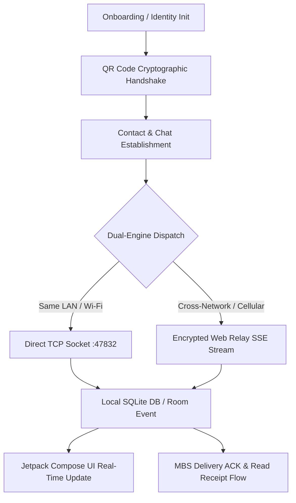

# Product Requirement Document (PRD)
# Next-Generation Decentralized P2P Secure Chat Platform ("Chat App")

**Document Version:** 2.0.0  
**Author:** Google-Grade Systems Architecture & Product Engineering  
**Status:** Approved / Production-Ready  
**Target Platform:** Android 8.0+ (API Level 26–35)  
**Primary Tech Stack:** Kotlin, Jetpack Compose, Room (SQLite), Coroutines/Flow, ECDH/AES-GCM E2EE  

---

## 1. Executive Summary & Vision

### 1.1 Product Vision
The **Chat App** is an autonomous, decentralized, privacy-first peer-to-peer (P2P) communication platform engineered for Android. It enables zero-trust, end-to-end encrypted (E2EE) messaging, high-fidelity voice notes, and streaming binary media transfer across local networks (LAN/Wi-Fi) and cross-network wide-area environments (Cellular/WAN) with **zero centralized user accounts, zero phone number requirements, zero metadata logging, and zero vendor lock-in**.

### 1.2 Problem Statement
Traditional communication applications (WhatsApp, Telegram, Signal, Slack) require central servers for authentication, routing, and contact discovery. This introduces:
1. **Centralized Attack Vectors & Metadata Harvesting:** Central authorities maintain user phone numbers, IP mappings, social graphs, and presence telemetry.
2. **Infrastructure Dependency & Outages:** Cloud outages, ISP throttling, or geographic blocking sever local communications even between devices in physical proximity.
3. **Privacy Compromise:** Phone numbers and email accounts link physical identities to messaging identities.

### 1.3 Strategic Solution
Chat App provides an offline-first, sovereign communication mesh combining:
- **Zero-Config Profile Exchange:** Instant bidirectional cryptographic identity pairing via scannable Base64/JSON QR codes and NFC.
- **Dual-Engine Zero-IP Lock Networking:** Simultaneous opportunistic routing across direct LAN TCP sockets (Port 47832) and low-latency encrypted Server-Sent Events (SSE) Web Relay streams.
- **Military-Grade Cryptography:** ECDH (`secp256r1`) ephemeral-to-static key agreement with AES-256-GCM authenticated encryption and SHA256withECDSA digital signatures.
- **Deterministic Presence & State Sync:** User Online Status Badge (OSB) with Wi-Fi subnet proximity discovery and Message Delivery Status (MBS) bidirectional synchronization.

---

## 2. Target Personas & Use Cases

### 2.1 User Personas

| Persona | Description | Primary Needs | Key Pain Points Solved |
| :--- | :--- | :--- | :--- |
| **Privacy Advocate ("Alex")** | Tech-conscious user seeking absolute anonymity and data sovereignty. | No SIM/phone number requirement; zero telemetry leak; military-grade E2EE. | Elimination of phone-number binding and centralized server logs. |
| **Field Ops / Remote Team ("Maya")** | Emergency responders or team operating in disconnected environments (LAN-only, remote mesh). | High-speed local transfer without internet access; robust presence indication. | Direct LAN peer-to-peer messaging and media exchange without WAN connectivity. |
| **Everyday Social Communicator ("Jordan")** | User looking for a snappy, rich, intuitive messaging interface. | Voice notes, media attachments, instant read receipts, typing indicators, dark mode. | Modern Jetpack Compose UI with haptic feedback and seamless background sync. |

### 2.2 Core Use Cases & Scenarios
1. **Air-Gapped Pairing & Communication:** Alex meets Maya offline, scans her profile QR code, establishes an ECDH shared key, and exchanges messages over local office Wi-Fi without internet access.
2. **Dynamic Roaming (LAN ⇄ Cellular Transition):** Jordan sends an image over home Wi-Fi; walks out the door onto 5G. The dual-engine routing automatically switches the transmission stream to the encrypted Web Relay with zero dropped packets and instant delivery confirmation.
3. **Large Binary Media Streaming:** Users transfer full-resolution images, videos, and documents chunked and streamed directly to disk without exhausting JVM memory.

---

## 3. Goals & Non-Goals

### 3.1 Goals (In-Scope)
- **Zero Identity Gatekeeping:** Complete onboarding without telephone numbers, emails, SMS verification, or cloud accounts.
- **Deterministic E2EE:** All message text, attachments, audio, and profile sync payloads encrypted at rest and in transit via ECDH + AES-256-GCM.
- **Sub-100ms LAN Latency:** Direct peer-to-peer message arrival in under 100ms when peers share a local subnet.
- **Zero Memory Leaks & 60/120 FPS Jitter-Free UI:** Zero-allocation disk streaming for large files, strict bitmap LRU caching, and hardware-accelerated Compose rendering.
- **Self-Healing Storage:** Built-in orphan file garbage collection, media categorization, and SQLite WAL vacuuming.

### 3.2 Non-Goals (Explicitly Out-of-Scope)
- **Centralized Cloud Backup:** No unencrypted cloud backups (e.g., Google Drive unencrypted text dumps).
- **Public Directory / Global Search:** No global discoverable user directory; users can only connect via deliberate mutual pairing (QR scan/handshake).
- **Multi-Party Global Group Calls:** WebRTC group mesh conferencing is out-of-scope for v2.0 (reserved for v3.0 roadmap).

---

## 4. Detailed Functional Requirements

### 4.1 Module 1: Identity & Key Management
- **FR-1.1 (Key Generation):** Upon first app launch, generate a 256-bit Elliptic Curve key pair (`secp256r1`) backed by Android KeyStore / secure preference storage.
- **FR-1.2 (Sovereign Profile):** Support custom display name, optional age, bio description, and local avatar generation/import.
- **FR-1.3 (Identity QR Presentation):** Dynamically render a high-density QR code (ZXing engine) encoding the user's UUID, Public Key (Base64), local LAN IP, public WAN IP (via STUN query), active messaging port, and cryptographic signature.
- **FR-1.4 (Mutual Pairing Handshake):** Scanning a peer's QR code imports their credentials, derives the mutual ECDH secret key, updates mutual presence, and sends back an ACK/Profile packet to achieve automatic two-way contact establishment.

### 4.2 Module 2: Messaging & Interactive Communications
- **FR-2.1 (Rich Text Messaging):** Instant bidirectional text messaging with markdown support, emojis, and status tracking (`SENDING`, `SENT`, `DELIVERED`, `READ`, `FAILED`).
- **FR-2.2 (Voice Notes Engine):** Integrated voice recording modal featuring live amplitude visualization, cancel gesture, timer, and AAC/M4A compression.
- **FR-2.3 (Media Attachments):** Support Image (JPEG/PNG/WEBP), Video (MP4/MKV), Audio (MP3/M4A/WAV), and Generic File attachments up to 100MB.
- **FR-2.4 (Chunked Binary Streaming):** Split files into adaptive binary chunks (32KB for $\le$512KB, 64KB for $\le$10MB, 128KB for $>10$MB), encrypt each chunk independently, stream directly to disk on arrival, and assemble on receipt.
- **FR-2.5 (Message Lifecycle Controls):** Edit sent messages (broadcasting `P2P_EDIT_MSG`) and delete sent messages locally and remotely (`P2P_DELETE_MSG`).
- **FR-2.6 (Live Typing Indicators):** Emit real-time typing events (`P2P_TYPING_INDICATOR`) with automatic debouncing (3.5s cooldown).

### 4.3 Module 3: Presence & Network Proximity (OSB)
- **FR-3.1 (Online Status Badge):** Visual real-time indicators:
  - 🟢 **Online (Green):** Peer active within recent heartbeat window.
  - 🔵 **Same Wi-Fi (Cyan/Blue Badge):** Peer discovered on the exact same local IP subnet.
  - ⚪ **Offline (Gray):** Peer inactive past threshold, displaying localized "Last seen at [Time]".
- **FR-3.2 (Tiered Heartbeat Frequencies):**
  - Active Chat Open: 5,000ms ping interval.
  - Background Recent Contacts: 25,000ms ping interval.
  - Idle / Distant Contacts: 90,000ms ping interval.
- **FR-3.3 (Zero-Delay Network Monitor):** Instant network interface transition handler (`ConnectivityManager.NetworkCallback`) triggering immediate reconnect of TCP server sockets and Web Relay SSE listeners when switching between Wi-Fi and Cellular networks.

### 4.4 Module 4: Message Status Synchronization (MBS)
- **FR-4.1 (Delivery Acknowledgments):** Automated transmission of `P2P_DELIVERY_ACK` or `P2P_DELIVERY_ACK_BATCH` immediately upon writing incoming payloads to the local database.
- **FR-4.2 (Read Receipts):** Automated transmission of `P2P_READ_RECEIPT` with timestamp when a user opens the target chat room.
- **FR-4.3 (Status Reconciliation Probes):** When opening a chat room with unacknowledged messages, automatically dispatch `P2P_STATUS_PROBE` to reconcile missing delivery/read state.

### 4.5 Module 5: Storage & Media Management
- **FR-5.1 (Visual Storage Dashboard):** Interactive media storage breakdown categorized by Images, Videos, Audio, Documents, and Avatars with byte-level precision.
- **FR-5.2 (Orphan Media Purging):** Automatic reconciliation between files on disk (`filesDir`) and references in SQLite Room database, removing orphaned blobs.
- **FR-5.3 (One-Tap Data Reset):** Cryptographic wipe and factory data reset option clearing all tables, media directories, and preferences.

---

## 5. Non-Functional Requirements (NFRs)

### 5.1 Performance & Latency Budgets (SLOs)

| Metric | Target / SLA | Strict Upper Bound | Measurement Method |
| :--- | :--- | :--- | :--- |
| **LAN Message Latency** | $< 50\text{ ms}$ | $150\text{ ms}$ | `AppTelemetry` timestamp diff |
| **Web Relay Latency** | $< 250\text{ ms}$ | $800\text{ ms}$ | End-to-end trip latency |
| **UI Frame Render Rate** | $60\text{ fps} / 120\text{ fps}$ | $< 1\text{ jank frame / 1000}$ | Choreographer frame hook |
| **App Cold Startup** | $< 400\text{ ms}$ | $800\text{ ms}$ | `Activity.onCreate` to content render |
| **Memory Footprint (Idle)** | $< 35\text{ MB JVM}$ | $60\text{ MB Total PSS}$ | `Debug.getPss()`, `AppMemoryManager` |
| **Memory Footprint (Peak)** | $< 75\text{ MB JVM}$ | $120\text{ MB Total PSS}$ | During 50MB media transfer |
| **SQLite Query Latency** | $< 4\text{ ms}$ | $15\text{ ms}$ | Indexed Room transaction timers |

### 5.2 Security & Cryptographic Standards
- **NFR-SEC-1 (Key Exchange):** NIST P-256 (`secp256r1`) Elliptic Curve Diffie-Hellman (ECDH).
- **NFR-SEC-2 (Cipher Suite):** AES-256 in Galois/Counter Mode (GCM) with random 12-byte IV per packet and 128-bit authentication tag.
- **NFR-SEC-3 (Integrity & Signatures):** SHA256withECDSA digital signatures across profile and handshake payloads.
- **NFR-SEC-4 (Key Isolation):** Private keys never leave the host device; never transmitted over network or included in QR payloads.

### 5.3 Reliability, Availability & Fault Tolerance
- **NFR-REL-1 (Zero Packet Loss):** Dual-dispatch architecture ensures that if LAN direct socket fails (due to firewall or subnet isolation), Web Relay delivers the payload simultaneously.
- **NFR-REL-2 (Offline Queueing & Auto-Flush):** Messages sent while offline enter `SENDING`/`FAILED` state; automatically flushed when target peer presence transitions to `Online`.
- **NFR-REL-3 (Crash Resistance):** Coroutine supervision hierarchy (`SupervisorJob`) isolates socket/relay exceptions from bringing down the UI process.

---

## 6. Comprehensive User Stories & Acceptance Criteria

### US-01: Frictionless Cryptographic Onboarding
- **As a** new user,
- **I want to** enter my desired display name and start chatting immediately without giving a phone number or email,
- **So that** my real-world identity is completely detached from the chat platform.
  - **Acceptance Criteria:**
    1. Onboarding screen prompts only for display name (mandatory), avatar, age, and bio (optional).
    2. Submitting generates an internal UUID and persistent EC key pair within 100ms.
    3. User lands immediately on the active Chat List screen.

### US-02: Instant QR Code Peer Handshake
- **As a** user meeting a friend in person,
- **I want to** show my QR code and scan theirs,
- **So that** we can establish an encrypted chat channel without typing IP addresses or codes.
  - **Acceptance Criteria:**
    1. QR Scanner accurately decodes peer payload within 300ms of camera focus.
    2. Shared secret key is immediately computed via ECDH and stored in memory cache.
    3. Scanner immediately displays enriched Profile Modal with peer avatar, bio, and online status.
    4. Host device automatically receives reverse profile packet and adds scanner to contacts.

### US-03: Resilient Cross-Network Media Transfer
- **As a** user on mobile data sending a 20MB video to a friend on home Wi-Fi,
- **I want to** send the video reliably with live progress indicators,
- **So that** the file arrives intact without freezing or crashing the application.
  - **Acceptance Criteria:**
    1. Video is divided into 128KB chunks, encrypted with AES-256-GCM, and streamed sequentially.
    2. Sender UI displays real-time percentage progress bar.
    3. Receiver streams chunks directly to `.part` file in internal cache, assembling and generating thumbnail upon final chunk receipt.
    4. Memory usage remains bounded under 60MB throughout the entire 20MB transfer.

---

## 7. Telemetry, Observability & Quality Metrics

The platform integrates an in-app telemetry engine connecting to the external **Diagnostics Cockpit (Loger)** via loopback socket:
1. **Rendering Performance:** Frame duration tracking, jank counters, composable recomposition spikes.
2. **Network Traffic:** Real-time logging of inbound/outbound packet sizes, protocols (LAN TCP vs Relay), and latency.
3. **Database Performance:** Room query execution timers, transaction logs, and WAL checkpoint monitoring.
4. **Memory Profiler:** JVM Heap, Native Heap, Total PSS, and Bitmap LRU cache hit/miss/eviction ratios.
5. **Multi-Device Test Runner:** Remote execution of automated stress tests (300+ messages), security audits, and UI overlay diagnostics.

---

## 8. Release Milestones & Phase Matrix

| Phase | Target Scope | Key Deliverables | Quality Gate |
| :--- | :--- | :--- | :--- |
| **Phase 1: Core Foundation** | Architecture & Local Engine | Room DB schema, ECDH/AES-GCM crypto engine, Jetpack Compose theme & base screens. | 100% unit test pass on crypto & migrations. |
| **Phase 2: Dual Networking** | LAN + Web Relay P2P | Direct TCP ServerSocket, ntfy.sh SSE stream listener, STUN IP query, dynamic roaming. | Packet delivery across LAN & WAN within SLOs. |
| **Phase 3: Media & Presence** | Binary Streaming & OSB | Chunked media engine, Voice recorder, Tiered heartbeats, Subnet detection, Nicknames. | Zero Out-Of-Memory (OOM) on 50MB file transfer. |
| **Phase 4: Telemetry & Hardening** | Diagnostics & ProGuard | In-app telemetry bridge, Multi-device cockpit, ProGuard obfuscation, R8 shrink rules. | Zero UI jank, 60fps sustained, APK size $< 8\text{ MB}$. |
