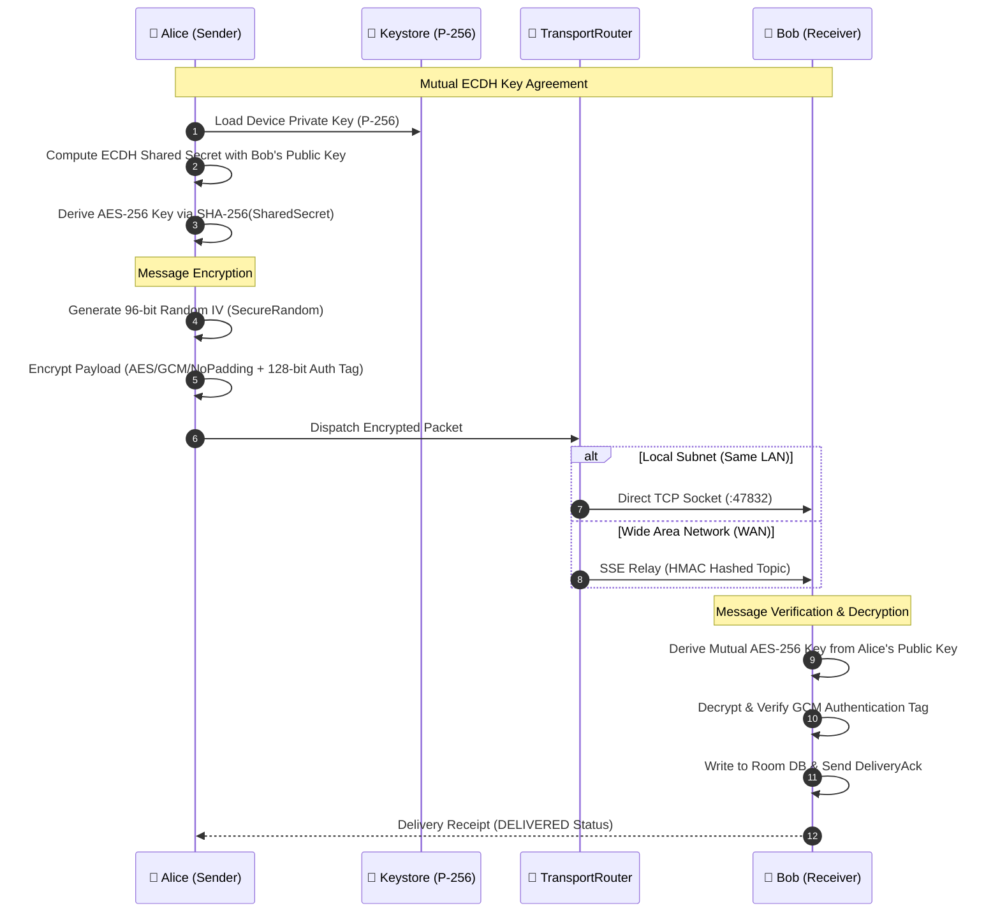
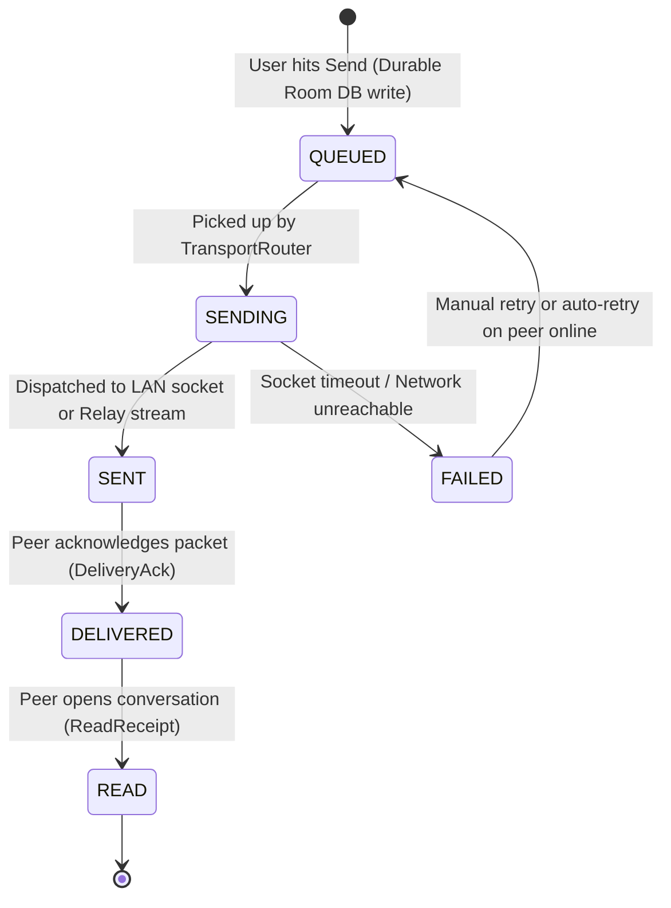

<div align="center">


# Sovereign P2P Secure Chat

### *Zero-Cloud • Zero-Trust • Hardware-Isolated • Peer-to-Peer Android Messenger*

[-3DDC84?style=for-the-badge&logo=android&logoColor=white)](https://developer.android.com)
[](https://kotlinlang.org)
[](https://developer.android.com/jetpack/compose)
[](#-cryptographic-security-model)
[](#-system-architecture)
[-F4511E?style=for-the-badge&logo=sqlite&logoColor=white)](https://developer.android.com/training/data-storage/room)

<p align="center">
  <a href="#-key-features">Key Features</a> •
  <a href="#-cryptographic-security-model">Security Model</a> •
  <a href="#-dual-transport-routing">Dual Transport</a> •
  <a href="#-system-architecture">Architecture</a> •
  <a href="#-developer-quickstart">Developer Quickstart</a> •
  <a href="#-project-structure">Project Structure</a>
</p>

---

</div>

## 📖 Overview

**Chat App** is a sovereign, privacy-first peer-to-peer messaging platform for Android designed for environments where centralized servers, telemetry, and vendor control cannot be trusted.

Built with **Kotlin 2.1** and **Jetpack Compose (Material 3)**, it enables end-to-end encrypted (E2EE) real-time communications over local networks (LAN / Wi-Fi) and wide-area networks (WAN / Cellular) without requiring phone numbers, email addresses, centralized user registries, or cloud databases.

```
                      ┌───────────────────────────────────────┐
                      │        Hardware Android Keystore      │
                      │         (NIST P-256 / secp256r1)       │
                      └──────────────────┬────────────────────┘
                                         │ Hardware-Isolated Private Key
                                         ▼
   ┌──────────────────────────────────────────────────────────────────────────┐
   │                       SOVEREIGN PEER DEVICE                              │
   │                                                                          │
   │   • Offline-First Room SQLite WAL      • SHA-256 Identity Fingerprints   │
   │   • AES-256-GCM Session Encryption     • SHA256withECDSA Signatures      │
   └────────────────────┬─────────────────────────────────┬───────────────────┘
                        │                                 │
           Direct TCP (Port 47832)               Zero-Knowledge SSE Relay
               Sub-50ms Latency                     HMAC Topic Hashing
                        │                                 │
                        ▼                                 ▼
              [ 📶 Local LAN Subnet ]           [ 🌐 Cellular / WAN ]
```

---

## ✨ Key Features

### 🛡️ Sovereign Identity & Key Management
- **Hardware-Backed Cryptography:** Elliptic Curve keys (`secp256r1`) generated and held strictly inside the **Android Keystore**. Private keys never touch RAM in raw form and cannot be exported.
- **Zero Centralized User Accounts:** No phone numbers, no email addresses, no central ID server, and zero third-party telemetry.
- **Dynamic Identity QR:** Cryptographically signed QR codes containing UUID, Public Key (Base64), SHA-256 key fingerprint, local IP/port, and ECDSA signature.

### 🤝 Trust-On-First-Use (TOFU) Pairing
- **Instant CameraX Scanner:** Rapid peer pairing via real-time camera QR scanning.
- **Anti-MITM Key Change Protection:** Automatic key fingerprint verification. If a contact's public key changes, the app blocks silent downgrades, triggers a security warning, and requires explicit user re-authorization.
- **Granular Contact Control:** Set custom nicknames, view cryptographic fingerprints, block contacts, or wipe session keys instantly.

### ⚡ Dual Multi-Transport Routing Engine
- **Direct LAN Transport (Port 47832):** Direct TCP server/client socket for sub-50ms message delivery between peers on the same Wi-Fi/Ethernet subnet without internet access.
- **WAN SSE Relay Transport:** Server-Sent Events (SSE) relay for global cellular/WAN connectivity using **HMAC-SHA256 topic hashing** (`p2p_chat_<HMAC>`) to prevent user enumeration on public relays.
- **Intelligent TransportRouter:** Seamlessly detects subnet reachability and auto-routes packets through the fastest available link without dual-dispatching redundant packets.

### 💾 Offline-First Durable Message Pipeline
- **Write-Ahead Persistence:** Messages are saved to Room SQLite in a `QUEUED` state *before* network delivery begins.
- **Deterministic State Transitions:** Smooth state updates: `QUEUED` ➜ `SENDING` ➜ `SENT` ➜ `DELIVERED` ➜ `READ` (or `FAILED` with retry actions).
- **Idempotent Delivery:** UUID deduplication ensures zero duplicate messages on unreliable connections.
- **Peer Presence & Heartbeat:** Real-time online/offline peer state tracking via lightweight background heartbeats.

### 🎨 Ultra-Modern Jetpack Compose UI
- **OLED Monochrome & Midnight Theme:** Premium dark-mode glassmorphic interface with frosted glass cards, glowing accent borders, and fluid micro-animations.
- **Rich Media & Audio Engine:** In-app audio voice recorder with real-time audio waveforms, media attachment picker, and dedicated Media Storage Manager with cache cleanup tools.

---

## 🔒 Cryptographic Security Model

The security model operates on a **zero-trust, hard-failure** invariant: if decryption, signature verification, or MAC validation fails, the packet is rejected. No plaintext fallback ever occurs.



### Cryptographic Invariants

| Component | Standard / Algorithm | Details |
|---|---|---|
| **Asymmetric Curve** | NIST P-256 (`secp256r1`) | Hardware-backed in Android Keystore |
| **Symmetric Cipher** | `AES/GCM/NoPadding` | 256-bit key length |
| **Initialization Vector** | 96-bit (12 bytes) | Fresh cryptographically secure random IV per packet |
| **Authentication Tag** | 128-bit GCM Tag | Guarantees ciphertext integrity & authenticity |
| **Key Derivation (KDF)** | SHA-256 | Deterministic digest of ECDH shared secret |
| **Signatures** | `SHA256withECDSA` | Used for QR payload identity verification |
| **Relay Privacy** | HMAC-SHA256 | Hashed pub/sub topics (`p2p_chat_<HMAC>`) |

---

## 🚦 Message Lifecycle State Machine

Every chat message moves through a deterministic state machine persisted in SQLite WAL:



### Status Visual Identifiers

| Status | Icon / Badge | Description |
|---|---|---|
| `QUEUED` | 🕒 *Clock* | Persisted locally in SQLite, waiting for network worker |
| `SENDING` | ⏳ *Spin* | Actively transmitting over TCP or SSE stream |
| `SENT` | ✓ *Single Check* | Accepted by transport layer |
| `DELIVERED` | ✓✓ *Double Check* | Cryptographically acknowledged by recipient device |
| `READ` | ✓✓ *Accent Check* | Opened and viewed in recipient's active chat window |
| `FAILED` | ⚠️ *Error Alert* | Transmission failed; tap to retry |

---

## 🏗️ System Architecture

The project is structured according to **Clean Architecture** principles with strict **Unidirectional Data Flow (UDF)**:

```
app/src/main/java/com/chat/app/
│
├── 📂 core/                    # Core extensions, result types, dispatchers
├── 📂 crypto/                  # Keystore, KeyManager, ECDH & AES-256-GCM SessionManager
├── 📂 data/
│   ├── 📂 local/room/          # Room DB (Entities, DAOs, Converters, Migrations)
│   ├── 📂 datastore/           # Preferences & configuration state
│   └── 📂 repository/          # Repository implementations
├── 📂 di/                      # Hilt Dagger modules (App, Database, Network, Crypto)
├── 📂 domain/
│   ├── 📂 model/               # Pure domain models (Identity, Contact, Message, etc.)
│   ├── 📂 repository/          # Repository contracts / interfaces
│   └── 📂 usecase/             # Business logic use cases
├── 📂 identity/                # Sovereign identity management & key generation
├── 📂 messaging/               # Chat engine, message processor, queues
├── 📂 media/                   # Audio recording, waveform rendering, media storage
├── 📂 onboarding/              # First-launch cryptographic profile setup
├── 📂 pairing/                 # QR generation, CameraX scanner & TOFU verifier
├── 📂 presence/                # Heartbeat engine & peer availability tracking
├── 📂 profile/                 # User profile, public key export & avatar management
├── 📂 settings/                # Security preferences, relays, storage analytics
├── 📂 transport/
│   ├── 📂 lan/                 # TCP ServerSocket & Client (:47832)
│   ├── 📂 relay/               # SSE WAN Relay client & HMAC routing
│   ├── 📂 protocol/            # Packet serialization & wire models
│   └── 📂 routing/             # Smart TransportRouter engine
└── 📂 ui/
    ├── 📂 components/          # Glassmorphic UI components, sheets & dialogs
    ├── 📂 navigation/          # Compose Navigation routes & bottom bar shell
    └── 📂 theme/               # Color palette, dark OLED theme & typography
```

---

## 🛠️ Tech Stack & Dependencies

- **Language:** [Kotlin 2.1+](https://kotlinlang.org/)
- **UI Framework:** [Jetpack Compose](https://developer.android.com/jetpack/compose) + [Material 3](https://m3.material.io/)
- **Dependency Injection:** [Hilt / Dagger](https://dagger.dev/hilt/)
- **Database & Persistence:** [AndroidX Room](https://developer.android.com/training/data-storage/room) (SQLite with WAL mode) + [DataStore Preferences](https://developer.android.com/topic/libraries/architecture/datastore)
- **Asynchronous & Reactive:** [KotlinX Coroutines](https://github.com/Kotlin/kotlinx.coroutines) + [Flow](https://kotlinlang.org/docs/flow.html)
- **Hardware Security:** [Android Keystore System](https://developer.android.com/training/articles/keystore) (`KeyGenParameterSpec`)
- **Camera & Scanning:** [CameraX](https://developer.android.com/training/camerax) (Core, Camera2, Lifecycle, View) + [ZXing Core](https://github.com/zxing/zxing)
- **Image & Media Loading:** [Coil Compose](https://coil-kt.github.io/coil/compose/) + [Coil Video](https://coil-kt.github.io/coil/videos/)

---

## 🚀 Developer Quickstart

### Prerequisites
- **JDK 17** (e.g. OpenJDK 17 or Microsoft JDK 17)
- **Android SDK** (API Level 35, Build-Tools 35.0.0)
- **ADB** configured in PATH or Android SDK platform-tools
- Connected Android Device (Android 8.0+ / API 26+) or Android Emulator with USB Debugging enabled

### ⚡ Live Watch & Continuous Deployment

This repository includes a smart automated watch runner (`watch.ps1` / `dev.ps1`) that tracks code changes, compiles incrementally, deploys the APK, and launches the app automatically:

```powershell
# Continuous Live Watch Mode (Rebuilds & installs on every file save)
.\watch.ps1

# Run a single build, install, and launch
.\watch.ps1 -Once

# Clean build before running
.\watch.ps1 -Clean

# Wipe app data on device before launching
.\watch.ps1 -ClearData

# Stream device Logcat filtered for Chat App tags
.\watch.ps1 -Logcat

# Target a specific connected ADB device ID
.\watch.ps1 -Device "6bb3fde3"
```

*Or use the shorthand alias:*
```powershell
.\dev.ps1 -Once
```

### 🔨 Standard Gradle Commands

```powershell
# Build Debug APK
.\gradlew assembleDebug

# Run Unit Tests
.\gradlew test

# Run Connected Android Instrumentation Tests
.\gradlew connectedAndroidTest

# Clean Build Cache
.\gradlew clean
```

---

## 📱 User Interface Highlights

<table>
  <tr>
    <td width="33%" align="center">
      <b>🚀 Instant Pairing</b><br><br>
      <i>CameraX QR scanner and signed public key generation with TOFU trust verification.</i>
    </td>
    <td width="33%" align="center">
      <b>💬 E2EE Chat</b><br><br>
      <i>Real-time encrypted messaging with typing indicators, audio notes, and delivery receipts.</i>
    </td>
    <td width="33%" align="center">
      <b>🗄️ Media & Storage</b><br><br>
      <i>Fine-grained media storage breakdown, auto-download quotas, and session key wipe.</i>
    </td>
  </tr>
</table>

---

## 🔐 Threat Model & Privacy Disclosures

1. **Relay Metadata Disclosure:** When communicating across WAN via an SSE relay, the relay server can observe packet timing, packet sizes, and hashed topic designations. **Message contents, attachments, and private keys remain fully end-to-end encrypted.**
2. **Local Subnet Reachability:** LAN transport requires both devices to be reachable on the local IP subnet without strict AP client isolation.
3. **Physical Device Security:** While private keys are hardware-isolated in the Android Keystore, local chat transcripts are stored in Room SQLite with app sandbox isolation. Rooted devices or compromised operating systems may access local SQLite databases.

---

## 📄 License

This project is licensed under the **Apache License 2.0**. See the [LICENSE](LICENSE) file for details.
